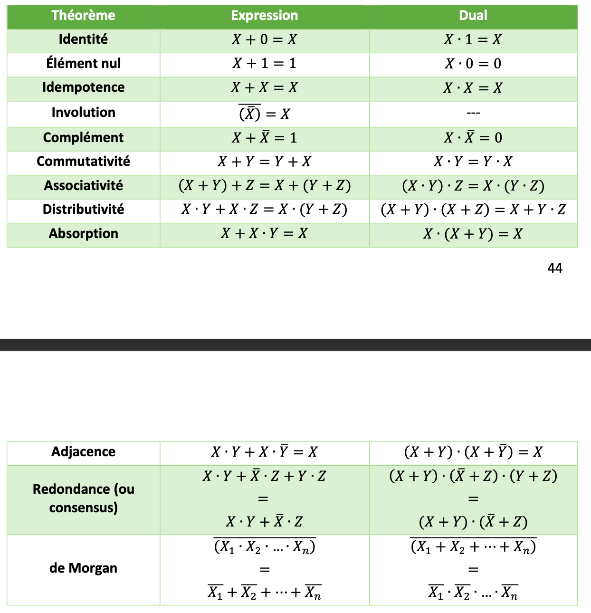

La démarche pour concevoir un système combinatoire se fait en plusieurs étapes:
1. L'analyse des spécifications fonctionnelles
2. La mise en équations des fonctions logiques
3. La simplification des équations
4. L'implémentation du système à partir des équations simplifiées
5. La validation du système

### L'analyse des spécifications fonctionnelles
Les spécifications fonctionnelles sont données par le client. Elles déterminent comment le système doit agir selon différente situation. 

### La mise en équation des fonctions logiques
La méthode privilégiée pour passer des spécifications aux équations est de rédiger la **table de vérité** qui représente le comportement du système numérique combinatoire avec un ou plusieurs variables booléennes.

Avec la table de vérité, on écrit ensuite la **table de Karnaugh**. 
#### Tables de Karnaugh
Dans une tables de Karnaugh, la section identifiée A est la section où la variable A vaut 1. Même chose pour la section B et la section C. On voit aussi dans le coin en haut à gauche quelle variable est situé sur quelle axe. On écrit avec le [code Gray](Représentation%20des%20nombres.md#Code%20BCD%20et%20code%20Gray)

La fonction logique est alors la somme de tous les **impliquants premiers**, les regroupements de 1. Ces regroupements suivent deux règles:
- Un impliquant premier doit réunir un nombre de 1 équivalent à un multiple de 2 (un groupe de trois 1 est impossible)
- Un impliquant premier doit regrouper le plus grand nombre de 1 logiques tout en respectant la première règle

#### Impliquants premiers essentiels
Parfois, les mêmes 1 logiques peuvent être encerclé de plusieurs façon, il faut alors choisir les impliquants qui limitent le nombre de regroupement et qui forment les plus grands groupes.

Si un impliquant premier est le seul à contenir un 1 logique particulier, on dit qu'il est essentiel puisque sans lui on ne représente pas vraiment le système.

#### Les indifférents
Si une combinaison est impossible, ou le résultat n'a pas d'importance, on désigne la sortie par un **indifférent** noté «x» en anglais *don't care*. Dans un table de Karnaugh, on choisi si l'indifférent vaut 0 ou 1 selon ce qui nous avantages le plus.

#### Somme de produits et produit de sommes
La fonction *F* obtenue è l'aide de la table de Karnaugh est maintenant simplifiée et constitue une **somme de produits**. Un fonction logique pourrait aussi être représentée par un **produit de sommes**. 

### Simplification des équations
Pour les cas simple, la table de Karnaugh permet de simplifier les équations. Cependant, lorsque le nombre de variables augmente, il faut **l'algèbre de Boole**.
#### Algèbre de Boole
Elle sert à manipuler des variables qui ont deux états possibles à l'aide d'une série de théorème.

En algèbre de Boole, on peut obtenir le **dual** d'une équation en remplaçant tous les 0 par des 1 et toutes les sommes par des produits et vice versa. Le dual d'un théorème est aussi vrai.

Voici une liste des théorèmes de l'algèbre de Boole: 

Comme en statistique, on représente un relation *ET* par un produit et une relation *OU* par une somme.