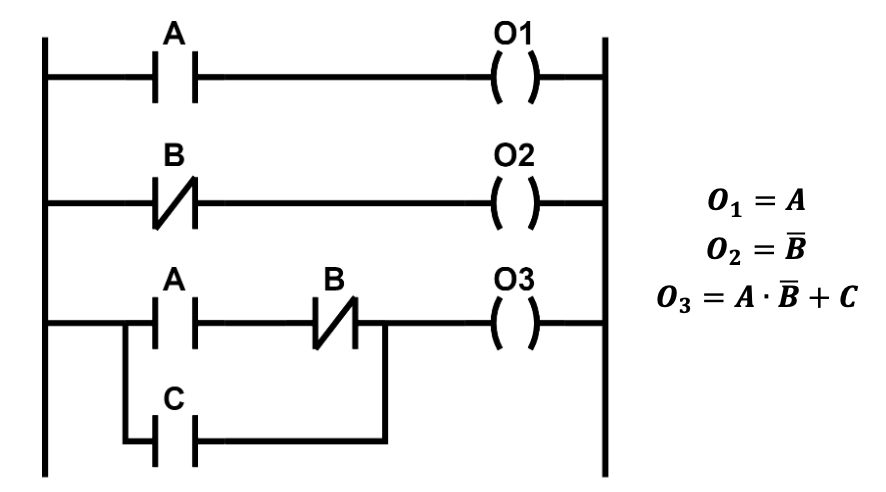

### Implémentation sur un automate programmable
Sur un automate, on implémente des fonctions logiques à l'aide d'un **diagramme à échelle**, *ladder* en anglais. Il se lit de gauche à droite et de bas en haut. Il se lit comme un circuit électronique, la ligne verticale gauche est la tension d'alimentation et la ligne verticale droite est la tension de référence. 
#### Instructions de base
On peut utiliser trois instructions de base pour faire un diagramme à échelle

Les instructions plus complexes dépendent du langages de programmation, pour les automates Rockwell, il est intéressant d'aller lire les instructions **BTD, COP, JSR, MOV**, aux **opérations mathématiques** et aux **instructions de comparaison** dans leur [documentation](https://literature.rockwellautomation.com/idc/groups/literature/documents/rm/1756-rm003_-en-p.pdf). 

Dans notre cas, il est préférable de moins utilisé l'instruction *JSR* ou *Jump to Sub-Routine* puisqu'elle rend notre logique plus complexe et plus difficile à corriger.
#### Temps de cycles d'un automates
